CUDA Path Tracer
================

**University of Pennsylvania, CIS 565: GPU Programming and Architecture, Project 3**

* Kevin Du
  * [LinkedIn](https://www.linkedin.com/in/kevinwdu/), [personal website](kevindu.dev)
* Tested on: Windows 11, Intel Core Ultra 5 225F @ 3.30 GHz 32 GB, RTX 5060 (8 GB)

## Final Renders

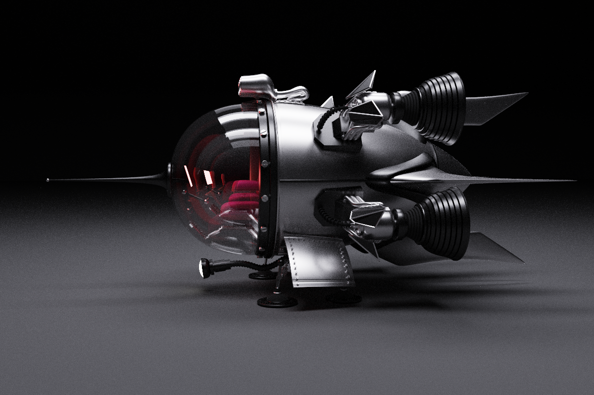

### (TODO: Your README)

*DO NOT* leave the README to the last minute! It is a crucial part of the
project, and we will not be able to grade you without a good README.

## Overview

## Core Features

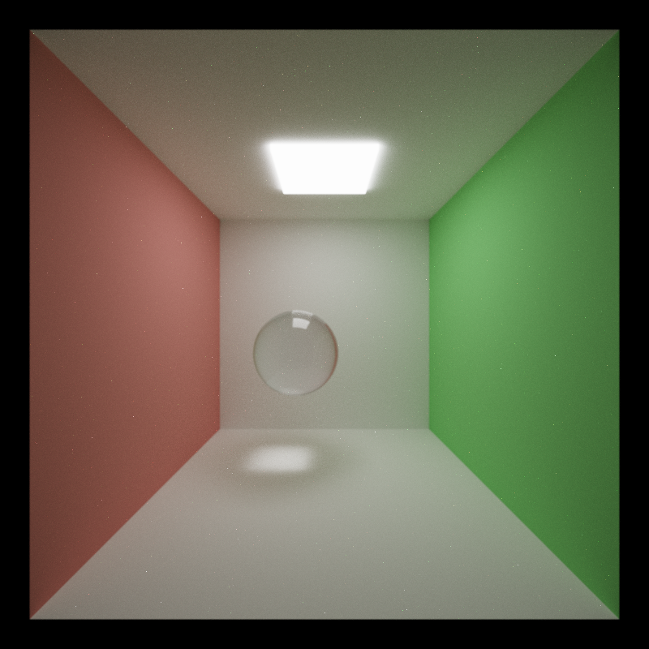

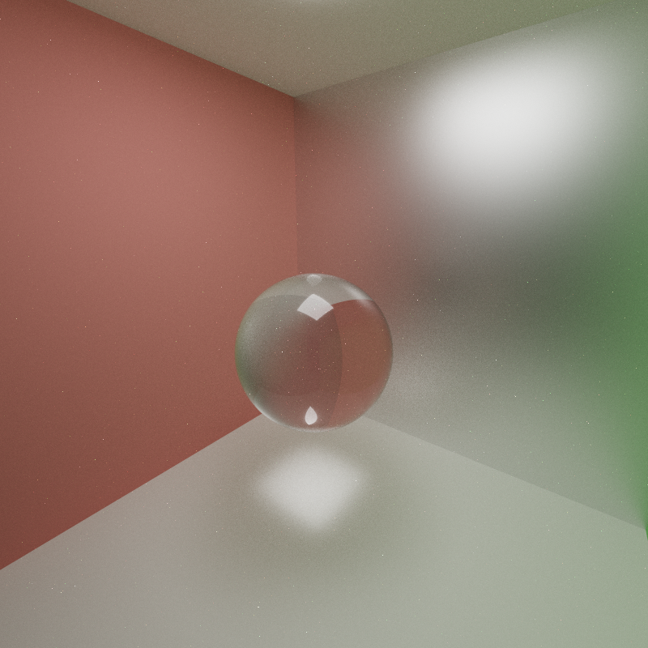

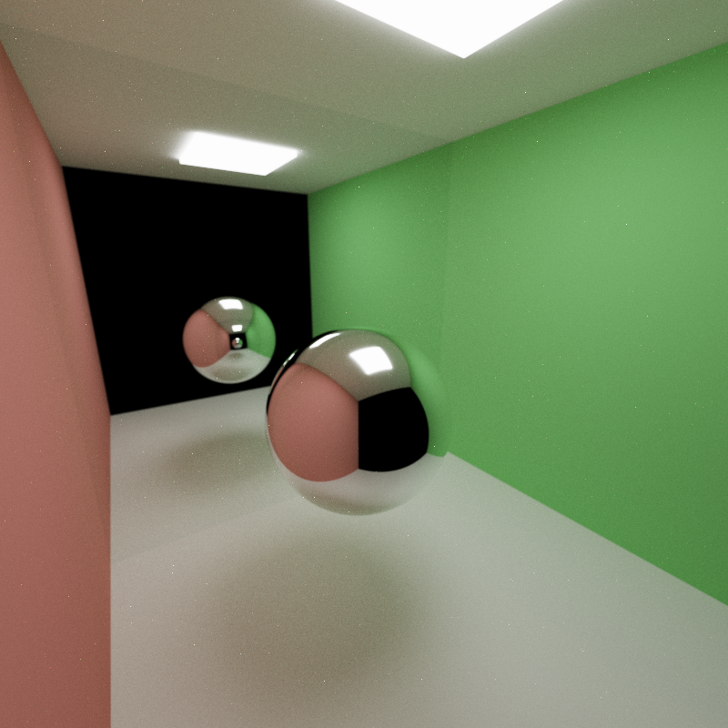

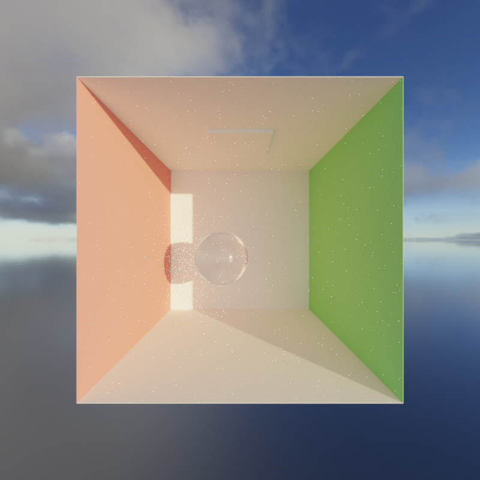

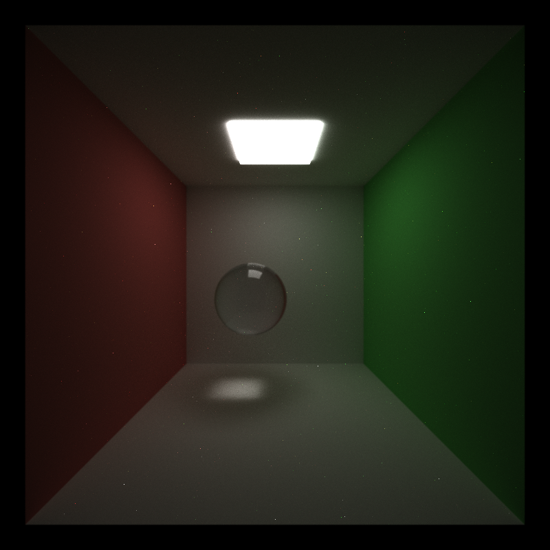

## Visual Improvements

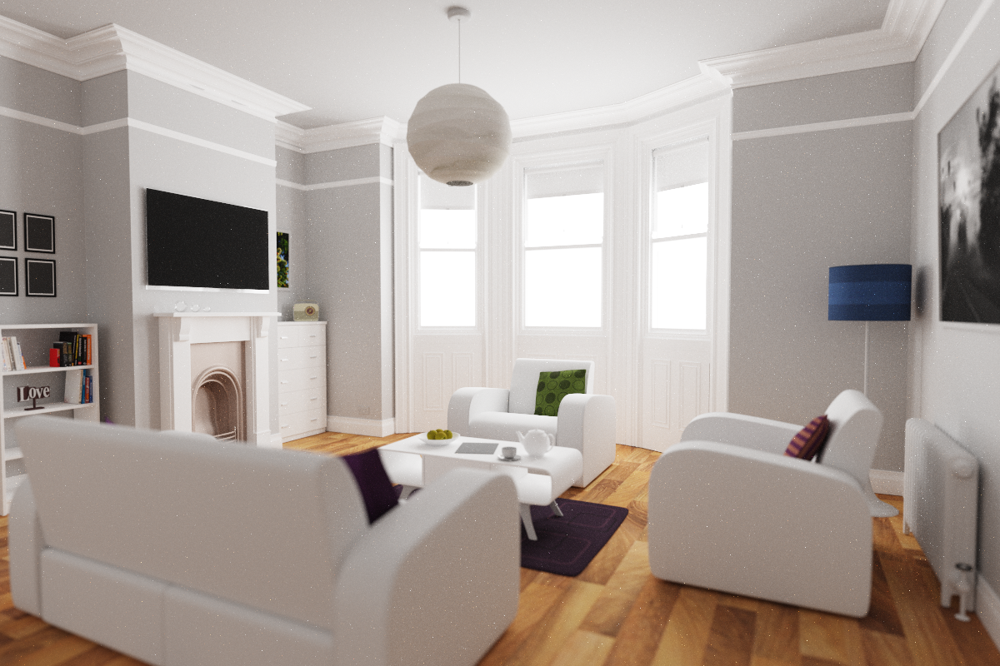

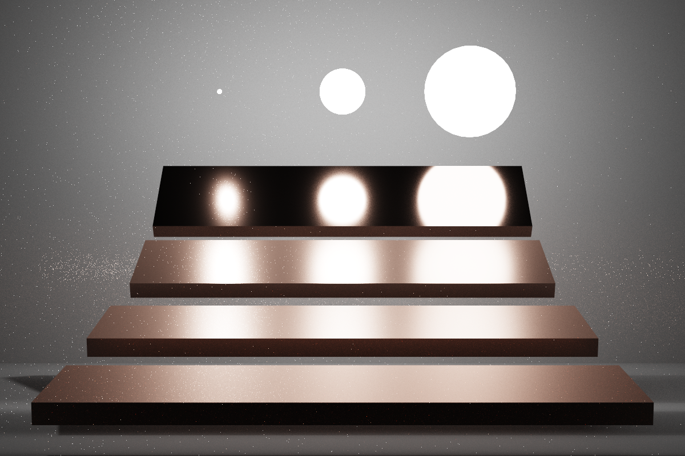

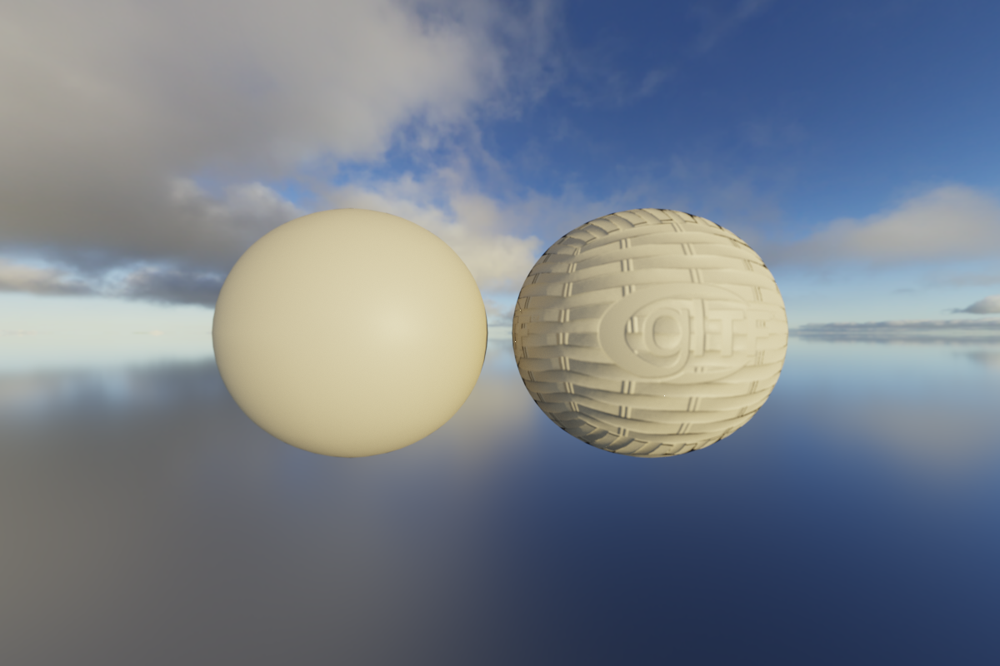

## Mesh Improvements

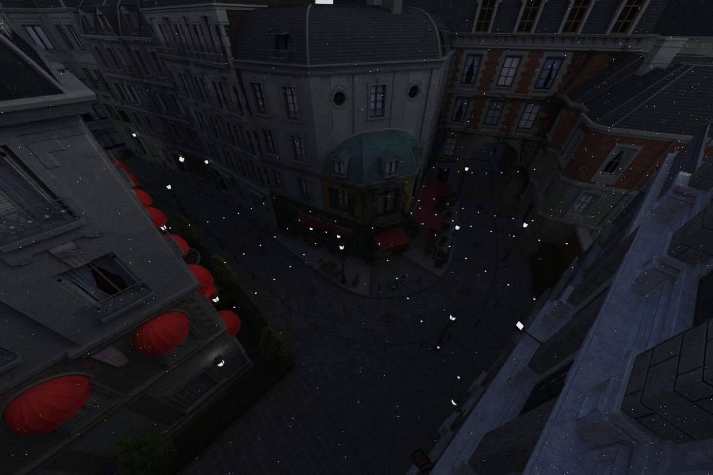

## Performance Improvements

## Additional Features

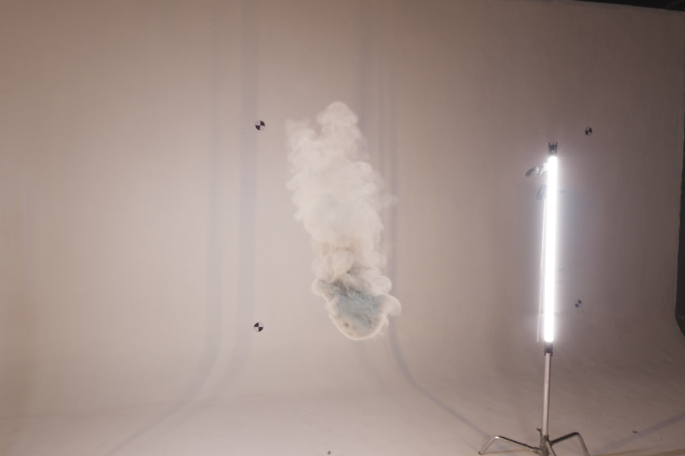
