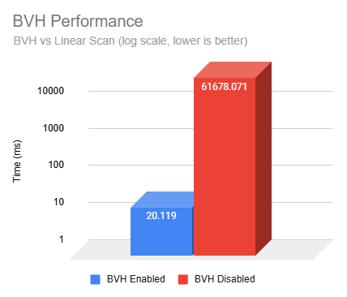
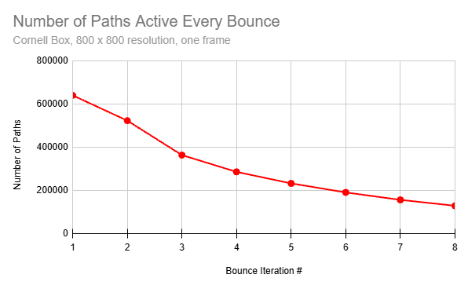
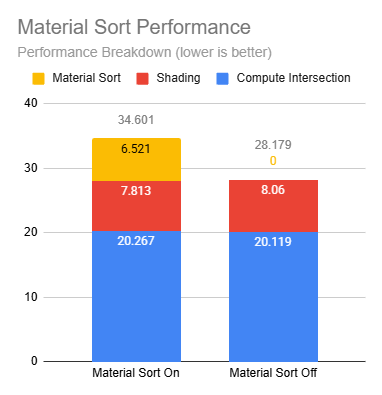
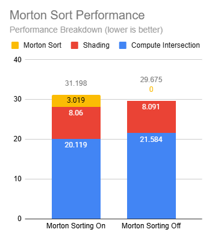

# CUDA Path Tracer

**University of Pennsylvania, CIS 565: GPU Programming and Architecture, Project 3**

* Kevin Du
  * [LinkedIn](https://www.linkedin.com/in/kevinwdu/), [personal website](https://kevindu.dev)
* Tested on: Windows 11, Intel Core Ultra 5 225F @ 3.30 GHz, 32 GB RAM, RTX 5060 (8 GB), CUDA 13.3, Visual Studio 2022


## Renders


## Overview

- **Core Features:** cosine-weighted diffuse scattering, stochastic pixel sampling for antialiasing, and toggleable sorting of active paths by material type before shading.
- **Materials and lighting:** mirror and Fresnel dielectric reflection/refraction, rough microfacet and metallic-roughness materials, emissive geometry, direct-light sampling with multiple importance sampling, and HDR environment lighting.
- **Camera and Image Improvements:** adjustable depth of field, ACES-fitted tone mapping
- **Assets and effects:** glTF/GLB meshes, base-color/metallic-roughness/normal textures, alpha-masked and blended materials, and NanoVDB volumetrics.
- **Performance Improvements:** a SAH BVH with GPU traversal, active-path and shadow-ray compaction, optional material and Morton ray sorting, and Russian roulette termination.

The renderer loads JSON, glTF, and GLB scenes, accumulates samples on the GPU, and previews the result through OpenGL.

## How the renderer works

The renderer launches one camera path per pixel. At each bounce it intersects the scene, prepares the hit material, samples direct lighting and the next scattering direction, accumulates the contributions of the paths that terminate, then compacts the surviving paths for the next bounce.

Direct lighting uses shadow rays and multiple importance sampling (MIS) to combine direct light sampling with scattering sampling. Russian roulette can terminate long paths that do not contribute greatly. Each new camera sample contributes to the progressive image until the scene's iteration limit or the user saves it.

The main implementation lives in [`src/pathtrace.cu`](src/pathtrace.cu). [`src/scene.cpp`](src/scene.cpp) loads JSON or glTF assets, HDR environments, and volume data and constructs the BVH. [`src/main.cpp`](src/main.cpp) provides the interactive viewer and a headless benchmark mode. Compile-time feature switches are collected in [`src/pathtrace_config.h`](src/pathtrace_config.h).

## Rendering features

### Materials and textures

The surface models include diffuse, mirror, dielectric, Cook–Torrance metallic-roughness, rough microfacet, and emissive materials. The display image uses an ACES-fitted tone curve and gamma correction.

| ACES-fitted tone mapping | Tone mapping disabled |
| :---: | :---: |
|  |  |

A dielectric path chooses reflection or refraction from its orientation and Fresnel probability. Mirror paths follow the reflected direction. For glTF metallic-roughness materials, Cook–Torrance shading combines a diffuse lobe with a GGX rough-specular lobe. A higher metallic value blends dielectric reflectance (0.04) closer toward the base color, while roughness controls the specular distribution. The renderer samples one lobe per bounce and divides its throughput by that lobe's selection probability. Direct-light BSDF evaluation uses the Trowbridge–Reitz distribution and a masking-shadowing term.

| Diffuse and dielectric | Rough microfacets | Mirror |
| :---: | :---: | :---: |
|  |  |  |


### Direct lighting and camera

Emissive geometry and HDR environments contribute direct light. The environment sampler uses an alias table to importance sample brighter directions; MIS balances those light samples against BSDF or volumetric phase-function samples. Each shaded point can sample an emissive primitive or an environment direction, enqueue a shadow ray to be processed by the shadow ray kernel, and weight the visible contribution against the BSDF or phase-function sampling strategy.

The Veach scene demonstrates the MIS direct-lighting behavior, showcasing a small light source's effects on diffuse surfaces, as well as a large light on specular surfaces, which naive pathtracing and direct lighting struggle with respectively.

Camera rays jitter within pixels for anti-aliasing, and a thin-lens model adds adjustable depth of field. The thin-lens camera samples an aperture disk with `radius × sqrt(u)` and a random angle. It moves the ray origin to that point and aims the jittered pixel ray toward a focal plane at the selected focus distance; pixel jitter remains active when depth of field is disabled.


| Multiple importance sampling test | Cornell box lit by HDR environment |
| :---: | :---: |
|  |  |

| Depth of field, back couch in focus |
| :---: |
|  |

### Meshes & alpha

The glTF loader supports triangle meshes with material and texture data. glTF import reads base-color, metallic-roughness, and normal textures, plus masked and blended alpha. Texture colors are converted for linear-light shading. The bathroom scene contains alpha-masked and blended materials, notably seen in the flowers. Shadow visibility accounts for transparent materials instead of treating every hit as opaque.

Surface preparation fetches texture values after a hit. Masked or blended alpha can let a path pass through the surface, at the cost of a higher bounce loop iteration count.

| Bathroom with alpha texture flowers | 
| :---: |
|  |

| Normals visualization | Bistro scene (~3.8 million triangles) |
| :---: | :---: |
|  |  |

### Volumes

The renderer also accepts NanoVDB density grids and supports HDR-lit volume scenes and volumes alongside geometry, with the volume being part of the scene's BVH structure.

Volume transport uses delta tracking against a global extinction majorant. Within the medium, the ray samples exponential collision candidate distances, reads local extinction from the sparse grid, and accepts a real collision with probability `σₜ / majorant`. Rejected candidates are null collisions: they keep the path direction and bounce depth. A real collision applies medium albedo and samples a Henyey–Greenstein phase direction to determine the ray's new orientation.

The volumetrics are integrated with MIS: direct-light shadow rays estimate medium transmittance with ratio tracking, multiplying by `1 − σₜ / majorant` at each candidate. The renderer also accumulates the logarithm of that null-collision product and uses it to compare the scattering-path PDF with the light-sampling PDF in the MIS power heuristic. This accounts for the probability from the sampled null-collision history when weighting the two strategies.

| Bunny cloud | Smoke volume |
| :---: | :---: |
|  |  |

### Ray ordering and path termination

With BVH traversal enabled, Morton sorting groups nearby ray origins and similar directions before primary and shadow intersection. The renderer quantizes origins into 64 cells per axis and directions into 16 bins per axis, interleaves them into 18-bit origin and 12-bit direction codes, and radix-sorts ray **indices** for queues of at least 4,096 rays to limit the impact of overhead. Path and shading data remain in place while traversal follows the sorted indices.

Russian roulette starts at the configured depth, with the goal of removing paths that will not contribute radiance to the image. A path survives with a probability based on its clamped maximum throughput component; surviving throughput is divided by that probability to keep the estimate unbiased. Terminated paths leave the active queue during path compaction.

### Feature costs

The table summarizes the work added by each of the features.

| Feature | What's the cost? |
| --- | --- |
| Refraction and mirror materials | Material branches add shading work and can keep rays active for more bounces. |
| Cook–Torrance metallic-roughness | Texture reads, BSDF and PDF evaluation, and varying material branches add work, cause divergence. |
| Direct lighting and HDR environment | Light sampling, shadow traversal, and PDF calculations add work. |
| Depth of field | Adds a small amount of random draws, trigonometry, and vector operations per camera path. |
| glTF textures and alpha | Expensive, requires texel reads, possible pass-through paths, and transparency-aware shadow traversal. |
| NanoVDB volumetrics and delta tracking | Candidate sampling and NVDB grid reads add work, with variable loop lengths across rays.|
| Medium transmittance and MIS | Shadow-grid reads and PDF bookkeeping add work. |
| Russian roulette | Adds a random draw but can shorten later bounces and reduce active path counts. |
| Morton-code ray sorting | Intersection time fell from 21.584 to 20.119 ms, but sorting cost 3.019 ms, making full sample time 4.2% higher with sorting enabled. |

## Performance analysis

The comparisons below use `scenes/bathroom_core.gltf` (592,188 triangles) at 1200 × 800 pixels and maximum depth 8 on the RTX 5060. Three launches each provided 24 measured samples per configuration. The table reports the mean and sample standard deviation of full GPU sample times, using CUDA-event measurements. They include traversal, shading, sorting, and compaction.

| Configuration | Mean sample time (ms) | Std. dev. (ms) | Change from default |
| --- | ---: | ---: | ---: |
| Default | 37.424 | 0.551 | — |
| BVH disabled  | 61,694.621 | 779.584 | 1,648.5× slower |
| Material sorting enabled  | 44.077 | 0.758 | 17.8% slower |
| Morton sorting disabled  | 35.854 | 0.485 | 4.2% faster |
| Shadow-ray compaction disabled  | 35.879 | 0.967 | 4.1% faster |


### Bounding volume hierarchy

The CPU builds a flattened BVH using binned surface-area-heuristic (SAH) splits. On the GPU, a ray visits bounding boxes and tests triangles only in relevant leaves. Disabling the BVH instead scans all 592,188 scene primitives for each ray. Intersection time fell from **61,678.071 ms** with a linear scan to **20.119 ms** with the BVH. The full sample improved from **61,694.621 ms** to **37.424 ms**, about **1,649×**. The chart uses a logarithmic scale and plots **intersection time**, not full sample time.



### Stream compaction

After each bounce, CUB device selection performs stream compaction by copying surviving paths into a compact queue. Fewer paths remain active as rays leave the scene or terminate, so later bounces launch less work. When testing with an 800 × 800 **Cornell box** (open), the active queue shrinks from 640,000 paths at bounce 1 to 128,820 at bounce 8. Stream compaction improves performance in open scenes where many paths terminate every bounce, and thus should be stream compacted away to improve coherence.



Shadow-ray compaction separately removes inactive direct-light rays before visibility traversal. On the bathroom scene, turning shadow-ray compaction off reduced full sample time from **37.424 ms** to **35.879 ms**. The measured shadow-compaction stage cost about **1.018 ms** per sample, so skipping inactive rays inside the full shadow queue was cheaper here. Path compaction remained enabled in both runs.

An open scene lets paths escape early, so compaction should remove more work than in a closed scene such as `scenes/bathroom_core.gltf` where paths continue bouncing.

### Material sorting

The optional material sort groups paths by the hit material type before shading. That may improve coherence in the shading kernel, but it rarely seems to outweight key generation, sorting, and gathering time, unless the scene contains a very high number of materials (this scene only has 33 materials). In this scene, the material sort stage added **6.521 ms** per sample, while shading and gather improved by only **0.247 ms**. Full sample time increased **17.8%**.



### Morton ray sorting

Morton codes group rays with nearby origins and directions before BVH traversal. The goal is for neighboring GPU threads to visit similar nodes, thereby reducing divergence and improving cache reuse. With sorting enabled, combined primary and shadow intersection time was **20.119 ms**, compared with **21.584 ms** when disabled. The **1.465 ms** intersection improvement was smaller than the **3.019 ms** sorting cost, so disabling Morton sorting improved total time by **4.2%** in this scene.



## Build and run

The tested build uses Windows 11, Visual Studio 2022, CMake, the NVIDIA CUDA Toolkit, and a CUDA-capable GPU. The project also links OpenGL, GLFW, and GLEW; GLM and tinygltf headers are supplied under `external/`. CMake looks for NanoVDB headers in `external/include` or `NANOVDB_ROOT` and otherwise fetches the pinned OpenVDB release's header tree. Network access is needed for that fetch if the headers are not already available.

From the repository root, configure and build Release:

```powershell
cmake -S . -B build -G "Visual Studio 17 2022" -A x64
cmake --build build --config Release --parallel
```

Run a scene, optionally adding an HDR environment or a NanoVDB volume:

```powershell
.\build\bin\Release\cis565_path_tracer.exe scenes\cornell.json
.\build\bin\Release\cis565_path_tracer.exe scenes\bathroom_core.gltf
.\build\bin\Release\cis565_path_tracer.exe scenes\studio.hdr scenes\bunny_cloud.nvdb
.\build\bin\Release\cis565_path_tracer.exe scenes\spaceship_core.gltf scenes\bunny_cloud.nvdb --volume-scale 1.0
```

Place any scene and its referenced `.bin` or texture assets together as expected by the glTF file.

### Controls

The controls have been modified for user convenience. Left drag to orbit, right drag to zoom, middle drag to move in the camera's X/Z plane, `Space` to recenter, and `Esc` or `X` to save and exit.


### CMake changes from the starter project

`CMakeLists.txt` was modified beyond its source-file lists: it discovers or fetches NanoVDB headers, provides the optional `NANOVDB_ENABLE_ZIP` setting, enables CUDA extended lambdas for NanoVDB, and passes `/Zc:preprocessor` through MSVC/NVCC. It also adds the tinygltf, tone-mapping, and volume files to the target.


## Credits

The project uses [GLM](https://github.com/g-truc/glm), [tinygltf](https://github.com/syoyo/tinygltf), [stb image libraries](https://github.com/nothings/stb), [nlohmann/json](https://github.com/nlohmann/json), [GLFW](https://github.com/glfw/glfw), [GLEW](https://github.com/nigels-com/glew), [Dear ImGui](https://github.com/ocornut/imgui), [NanoVDB](https://github.com/AcademySoftwareFoundation/openvdb/tree/master/nanovdb), and [NVIDIA's CUDA Toolkit/CUB](https://developer.nvidia.com/cuda-toolkit).

### GLTF/VDB Files
- [GLTF Research Scenes](https://github.com/ErfanMo77/gltf-research-scenes/tree/main/scenes)
- [Bistro scene](https://github.com/zeux/niagara_bistro)
- [Smoke](https://github.com/mmp/pbrt-v4-scenes/tree/master/smoke-plume)
- [Bunny Cloud](https://github.com/mmp/pbrt-v4-scenes/tree/master/bunny-cloud)


### HDRIs
- [Studio](https://polyhaven.com/a/ferndale_studio_11)
- [Studio 2](https://polyhaven.com/a/studio_kominka_02)
- [Sky 2](https://polyhaven.com/a/kloofendal_43d_clear_puresky)
